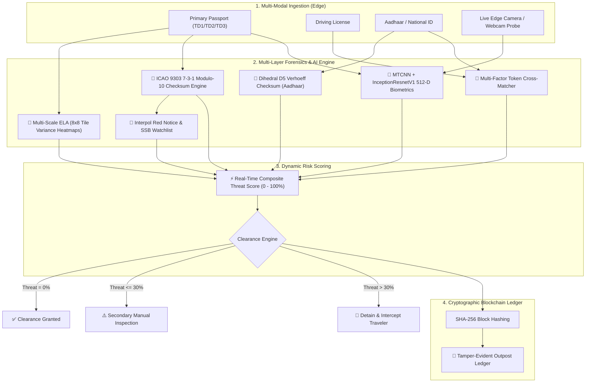

# 🛡️ SatyaScan: AI-Powered Edge Border Security & Forensic Screening Platform

[](https://www.python.org/)
[](https://streamlit.io/)
[](https://pytorch.org/)
[](https://opencv.org/)
[](#-icao-9303-mrz-cryptographic-checksums)
[](#-cybersecurity--blockchain-pillars)
[](LICENSE)

> **Offline-first, zero-trust edge intelligence platform engineered for defense forces and immigration checkpoints (SSB, BSF, Bureau of Immigration).**
> Combines multi-modal document forensics, deep biometric verification, mathematical checksum validation, real-time watchlist interception, and blockchain-anchored audit logging.

---

## 📌 Table of Contents
- [Executive Overview](#-executive-overview)
- [System Architecture](#-system-architecture)
- [Core Security Pillars](#-core-security-pillars)
  - [1. Multi-Scale Pixel Forensics (ELA)](#1-multi-scale-pixel-forensics-ela)
  - [2. ICAO 9303 MRZ Cryptographic Checksums](#2-icao-9303-mrz-cryptographic-checksums)
  - [3. Dihedral $D_5$ Verhoeff Algorithm](#3-dihedral-d_5-verhoeff-algorithm)
  - [4. Deep Biometric Face Topology (512-D)](#4-deep-biometric-face-topology-512-d)
  - [5. Fuzzy Cross-Credential Triangulation](#5-fuzzy-cross-credential-triangulation)
  - [6. Watchlist & Interpol Red Notice Engine](#6-watchlist--interpol-red-notice-engine)
  - [7. Blockchain-Anchored Audit Ledger](#7-blockchain-anchored-audit-ledger)
- [Operational Modules](#-operational-modules)
- [Repository Structure](#-repository-structure)
- [Installation & Setup](#-installation--setup)
- [Demo Walkthrough & Test Credentials](#-demo-walkthrough--test-credentials)
- [Technology Stack](#-technology-stack)
- [Defense & Air-Gapped Compliance](#-defense--air-gapped-compliance)

---

## 🌐 Executive Overview

Remote border checkpoints (such as Indo-Nepal and Indo-Myanmar borders managed by **Sashastra Seema Bal - SSB**) operate in challenging environments with **intermittent or zero internet connectivity**. Traditional cloud-reliant identity verification systems fail under air-gapped conditions and introduce serious risks of telemetry intercept attacks.

**SatyaScan** solves these critical challenges with an edge-native defense architecture:
1. **100% Air-Gapped & Offline Execution**: EasyOCR, MTCNN, InceptionResnetV1, and forensic engines run strictly on local hardware with zero external API dependencies.
2. **Multi-Factor Fraud Resistance**: Dissects documents mathematically, optically, and biometrically to detect digital splicing, synthetic IDs, and impersonation.
3. **Cross-Credential Triangulation**: Correlates Primary Passports (ICAO MRZ), Driving Licenses, and Aadhaar IDs with live probe camera captures.
4. **Tamper-Proof Auditability**: Employs SHA-256 chained blocks ensuring immutable recordkeeping resistant to insider threat or bribery.

---

## 🏗️ System Architecture



---

## 🔒 Core Security Pillars

### 1. Multi-Scale Pixel Forensics (ELA)
- **Threat Addressed**: Digital photo splicing, cloning, copy-move attacks, altered expiration dates, or spliced names.
- **Methodology**: Evaluates JPEG compression error differentials $\Delta = |I_{orig} - I_{resaved@Q90}|$ across localized $8 \times 8$ pixel grids.
- **Heatmap Visualization**: Generates a **Jet Colormap Heatmap** isolating high-energy discontinuities where pixels were altered.
- **Mathematical Ratio**: Flags tampering if the localized variance ratio $\frac{\sigma_{max}}{\sigma_{mean}} > 1.85$.

### 2. ICAO 9303 MRZ Cryptographic Checksums
- **Standard**: Full compliance with **ICAO Doc 9303** Machine Readable Travel Documents (MRTD).
- **Algorithm**: Implements the **7-3-1 Repeating Modulo-10 Checksum**:
  $$\text{Check Digit} = \left( \sum_{i=1}^{n} \text{Weight}_i \times \text{CharVal}(c_i) \right) \pmod{10}$$
  where $\text{Weights} = [7, 3, 1, 7, 3, 1, \dots]$
- **Cross-Zone Reconciliation**: Verifies 5 separate check digits (Document Number, DOB, Expiry, Optional Data, Composite Hash) and cross-checks Visual Inspection Zone (VIZ) text against the MRZ payload to catch spliced visual text.

### 3. Dihedral $D_5$ Verhoeff Algorithm
- **Threat Addressed**: Fabricated national identification credentials (Aadhaar cards).
- **Methodology**: Non-abelian Dihedral group of order 10 ($D_5$) combined with permutation table $P_8$.
- **Precision**: Catches 100% of single-digit substitution errors and over 99.8% of adjacent transposition errors ($ab \leftrightarrow ba$).

### 4. Deep Biometric Face Topology (512-D)
- **Threat Addressed**: Lookalikes and impostors attempting border crossing using stolen authentic documents.
- **Model Pipeline**:
  1. **MTCNN**: Multi-task Cascaded Convolutional Networks for landmark alignment and facial bounding box extraction.
  2. **InceptionResnetV1**: Pretrained on VGGFace2, extracts a normalized 512-dimensional facial topology embedding.
- **Metrics**: Computes **L2 Euclidean Distance** (threshold $< 0.95$) and **Cosine Similarity** ($\ge 0.65$) between document portrait and live webcam probe.

### 5. Fuzzy Cross-Credential Triangulation
- **Challenge**: Handles real-world variations (initials, reordered surnames, abbreviated names) across Passport, Driving License, and Aadhaar without compromising security.
- **Solution**: Combines Jaccard token set intersection, sorted token sequence matching, and initial-to-token cross-validation.

### 6. Watchlist & Interpol Red Notice Engine
- Real-time offline watchlist screening matching travelers against `blacklist.json`.
- Detects flagged criminals, international human trafficking suspects, Interpol Red Notices, and national intelligence alerts.

### 7. Blockchain-Anchored Audit Ledger
- Records every clearance transaction into a SHA-256 cryptographic chain containing:
  - Monotonic block index & UTC timestamp
  - $\text{SHA256}(\text{Traveler Info})$ and Biometric Embedding Hash
  - Clearance decision & composite threat score
  - Previous block hash & current block hash
- Guarantees **non-repudiation** and immediate detection of unauthorized log tampering.

---

## 🎛️ Operational Modules

SatyaScan provides a comprehensive tactical interface organized into six specialized command modules:

| # | Module Name | Primary Objective |
|---|---|---|
| 1 | **🛡️ Multi-Doc Triangulation** | Full border inspection pipeline: 3 credentials + live camera probe with real-time threat index scoring and clearance certificates. |
| 2 | **🔍 Forensic Deep-Scanner** | Standalone forensic analysis of any single document: ELA difference visualization, Jet heatmap overlay, and OCR extraction. |
| 3 | **👤 Biometric Face Lab** | Dedicated 1:1 facial verification comparing ID photo vs probe face with Euclidean distance and confidence metrics. |
| 4 | **🚨 Watchlist & Blacklist** | Centralized database of wanted individuals, Red Notices, and real-time query interface. |
| 5 | **📊 Outpost Audit Logs** | Cryptographic ledger viewer with block explorer and real-time SHA-256 chain integrity verification. |
| 6 | **⚡ Accuracy Benchmark** | Automated verification harness executing tests across genuine and synthetic test datasets. |

---

## 📁 Repository Structure

```text
├── app.py                         # Main Streamlit Border Security & Forensics Command Center
├── blacklist.json                 # Interpol & SSB Watchlist / Red Notice Database
├── requirements.txt               # Production Python dependencies
├── PROJECT_EXPLANATION_FOR_JUDGES.md # Technical pitch and presentation manual
├── test_pipeline.py              # Automated CLI testing pipeline for verification engines
├── data_down_organized.py        # Automated test suite builder for organized datasets
├── generate_mass_dataset.py       # Synthetic dataset generation utility
├── offline_audit_log.csv          # Local edge node audit log store
├── dataset_organized/             # Standardized evaluation credential suites
│   ├── Rahul_Kumar/              # Authentic, tampered, and impersonator test suites
│   ├── Priya_Sharma/             # Valid secondary citizen test suite
│   └── Vikram_Singh_Suspect/     # Blacklisted Interpol Red Notice test suite
└── README.md                      # Project documentation
```

---

## 🚀 Installation & Setup

### 1. Prerequisites
- Python 3.10 or higher
- Git
- Webcam (optional, for live probe verification)

### 2. Clone the Repository
```bash
git clone https://github.com/Vedansh2005/SatyaScan-VD.git
cd SatyaScan-VD
```

### 3. Create a Virtual Environment
```bash
# Windows
python -m venv .venv
.venv\Scripts\activate

# Linux / macOS
python3 -m venv .venv
source .venv/bin/activate
```

### 4. Install Dependencies
```bash
pip install -r requirements.txt
```

### 5. Launch the Command Center
```bash
streamlit run app.py
```
The application will launch in your default browser at `http://localhost:8501`.

---

## 🧪 Demo Walkthrough & Test Credentials

Pre-organized test credentials are located in `dataset_organized/` for instant evaluation:

### Scenario 1: Authentic Citizen Clearance
- **Folder**: `dataset_organized/Rahul_Kumar/`
- **Inputs**:
  - Primary ID: `1_passport_valid.jpg`
  - Secondary ID: `2_driving_license_valid.jpg`
  - Domestic ID: `3_aadhaar_valid.jpg`
  - Live Capture: `6_live_camera_valid.jpg` (or live webcam)
- **Expected Result**: **0% Threat Index — CLEARANCE GRANTED** (Green Border Certificate).

### Scenario 2: Tampered Document Interception
- **Folder**: `dataset_organized/Rahul_Kumar/`
- **Inputs**:
  - Primary ID: `4_passport_tampered.jpg` (Altered expiry date)
- **Expected Result**: **ELA Forensics Alert** (Variance ratio $> 1.85$), Jet heatmap highlights altered region, Dual-Zone VIZ-MRZ mismatch triggered.

### Scenario 3: Biometric Impersonator Detection
- **Folder**: `dataset_organized/Rahul_Kumar/`
- **Inputs**:
  - Primary ID: `1_passport_valid.jpg`
  - Live Probe: `7_live_camera_impersonator.jpg`
- **Expected Result**: **🚨 IMPERSONATION DETECTED** (Euclidean Distance $> 0.95$, clearance rejected).

### Scenario 4: Interpol Red Notice Intercept
- **Folder**: `dataset_organized/Vikram_Singh_Suspect/`
- **Inputs**:
  - Primary ID: `1_passport_valid.jpg`
- **Expected Result**: **⛔ WATCHLIST HIT** (Transnational human trafficking warrant flagged for immediate detention).

---

## 🛠️ Technology Stack

| Category | Technology | Usage |
|---|---|---|
| **Core Framework** | Python 3.10+, Streamlit | High-performance tactical edge dashboard |
| **Computer Vision** | OpenCV, Pillow | Image manipulation, compression differential analysis, Jet heatmaps |
| **Deep Learning** | PyTorch, `facenet-pytorch` | MTCNN face localization and InceptionResnetV1 (512-D embeddings) |
| **OCR Engine** | EasyOCR | Dual-zone text reading and VIZ extraction |
| **Standards Compliance** | `mrz` (ICAO Doc 9303) | TD1, TD2, TD3 MRZ validation & check digit verification |
| **Cryptography** | `hashlib` (SHA-256) | Verifiable audit block generation and chain validation |
| **Mathematical Models** | Dihedral $D_5$ Verhoeff | Aadhaar 12-digit permutation checksum validation |

---

## 🛡️ Defense & Air-Gapped Compliance

- **Zero Cloud Leakage**: Designed to conform with national data sovereignty standards (DPDP Act, GDPR). No biometric telemetry leaves the local post.
- **Tamper-Evident Outpost Ledger**: Any retroactive manual alteration to local logs breaks the SHA-256 hash continuity.
- **High-Throughput Edge Operation**: Sub-second algorithmic evaluation for check digits, token matching, and pixel variance.

---

## 👥 Contributors
- **Vedansh** ([@Vedansh2005](https://github.com/Vedansh2005))
- Developed for border protection and national security modernization.

---

## 📄 License
This project is licensed under the [MIT License](LICENSE).
